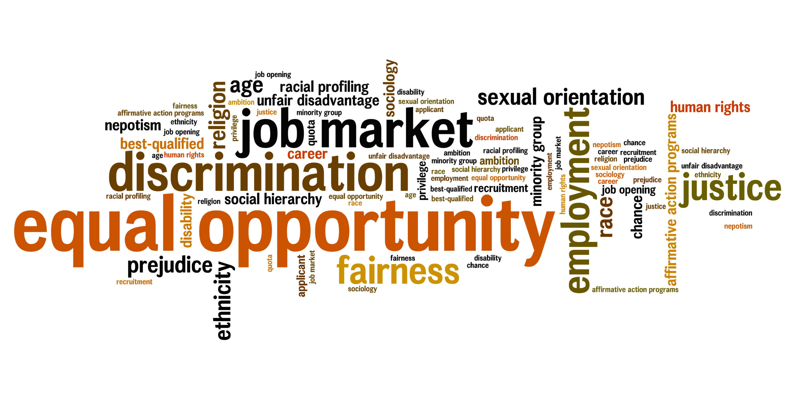

# Approach

-   Transparency with job posting

    -   Defining exactly what we are looking for

    -   Salary ranges

    -   Defining the steps of the interview process

    -   Day-to-day duties

    -   Leniency on application materials

-   Reach

    -   Social Media content about the jobs and how to apply

    -   Live Webinar about Job with Q&A

        -   include more information on application material

    -   Engaging with universities and other groups

    -   Actively engage with DS community groups 

        -   [Data Visualization Society](https://jobs.datavisualizationsociety.org/)

        -   [R4DS](https://www.rfordatasci.com/)

        -   [Minorities in R (MiR) Community](https://mircommunity.com/)

        -   [EcoDataScience](https://eco-data-science.github.io/)

-   Interviews

    -   Interviewing as many people as possible

    -   Limiting use of self-assessments that tend to bias

    -   Pre-interview qualitative assessment power skills (passion, desire to learn, collaboration, etc.)

-   On-boarding

    -   Hiring in cohorts

        -   Community focus

        -   Peer support

    -   Resource groups

        -   BIPOC/LGBTQ+/Early Career working grouping
