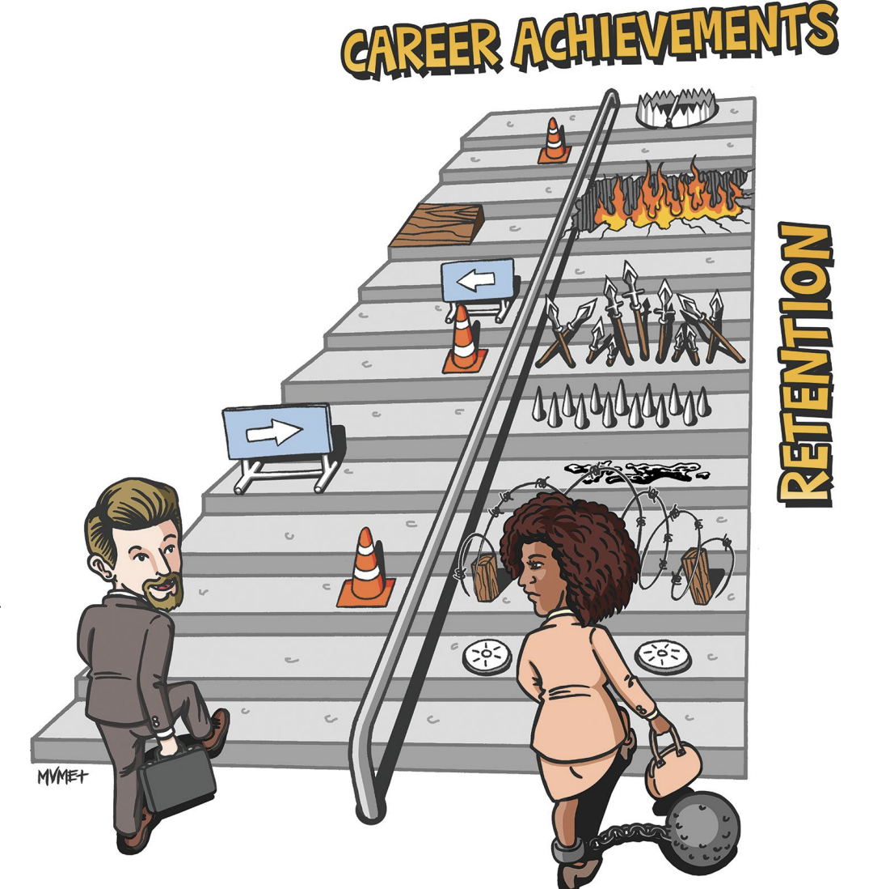

--- 
title: "Redesigning hiring practices to increase equity and inclusion in the Environmental Data Science (EDS) workforce"
author: "Margaux Sleckman, Elmera Azadpour, Ian Brunjes, Ciera Martinez, Michelle Tigchelaar"
date: "`r Sys.Date()`"
site: bookdown::bookdown_site
---

# Idea

A manifesto to redesign hiring practices that increase equity and inclusion in the Environmental Data Science (EDS) workforce. Here we lay out the problem space and provide approaches to expand diversity, equity, inclusion and accessibility (DEIA) in the hiring process.

